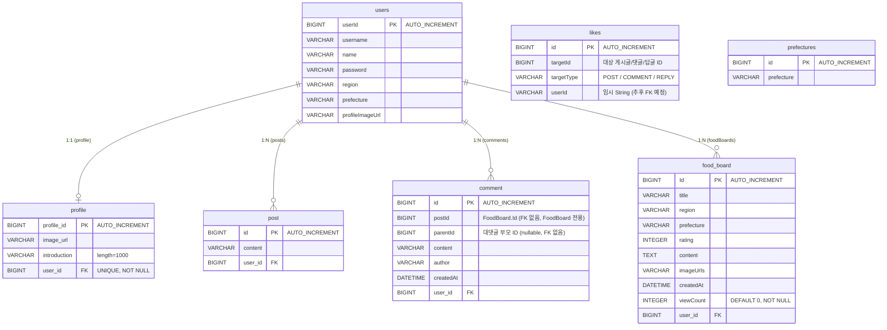

# ERD (Entity Relationship Diagram)

저장소의 JPA 엔티티 기반으로 작성된 ERD입니다.

## 엔티티 설명

| 엔티티 | 테이블명 | 설명 |
|--------|----------|------|
| `User` | `users` | 사용자 계정 정보 |
| `Profile` | `profile` | 사용자 프로필 (이미지, 자기소개) |
| `Post` | `post` | 일반 게시글 |
| `Comment` | `comment` | 게시글 댓글 및 대댓글 (FoodBoard 대상) |
| `FoodBoard` | `food_board` | 음식 게시판 게시글 |
| `Like` | `likes` | 게시글/댓글/답글 좋아요 |
| `Prefecture` | `prefectures` | 일본 도도부현 참조 데이터 |

## 관계 요약

- **User — Profile**: 1:1 (`profile.user_id` → `users.userId`, UNIQUE)
- **User — Post**: 1:N (`post.user_id` → `users.userId`)
- **User — Comment**: 1:N (`comment.user_id` → `users.userId`)
- **FoodBoard — Comment**: `comment.postId`가 `food_board.Id`를 저장 (명시적 FK 없음, **Post 엔티티와는 댓글 관계 없음**)
- **User — FoodBoard**: 1:N (`food_board.user_id` → `users.userId`)
- **Like**: 독립 테이블. `targetId` + `targetType`("POST"/"COMMENT"/"REPLY") 조합으로 좋아요 대상을 구분
- **Prefecture**: 독립 참조 테이블 (다른 엔티티와 외래키 관계 없음)

## 비고

- `Comment.postId`: FoodBoard의 ID를 저장 (명시적 FK 없음, **Post 엔티티와는 무관**)
- `Comment.parentId`: 대댓글 구현용 자기 참조 필드 (명시적 FK 없음)
- `Like.userId`: 현재 String 타입으로 임시 저장 (FK 없음, 추후 `users.userId` FK로 교체 예정)
- `Post.likeCount`, `Post.likedByMe`: `@Transient` — DB에 저장되지 않는 계산 필드
- `FoodBoard.likeCount`, `FoodBoard.likedByMe`, `FoodBoard.commentCount`: `@Transient` — DB에 저장되지 않는 계산 필드
